# Tratamientos faciales
## ✨ Mesoterapia Virtual ✨
Tratamiento no invasivo diseñado para reducir grasa localizada y mejorar la apariencia de la piel sin necesidad de agujas 💆‍♀️. Se utilizan ampollas con principios activos como cafeína o vitaminas, aplicadas mediante tecnología de mesoterapia virtual que permite la penetración profunda de los activos en la piel.

🔬 ¿Cómo funciona?

La cafeína acelera la circulación sanguínea y linfática, favoreciendo la movilización de grasa acumulada en los adipocitos.

Las vitaminas y otros nutrientes ayudan a nutrir, revitalizar y reafirmar la piel desde el interior.

La tecnología virtual asegura la absorción de los activos sin dolor, estimulando el metabolismo natural para quemar la grasa liberada.

🌟 Beneficios principales:
✔️ Reducción de grasa localizada
✔️ Mejora la firmeza y elasticidad de la piel
✔️ Estimula la circulación y el drenaje linfático
✔️ Tonifica y suaviza la piel
✔️ Procedimiento seguro, indoloro y sin tiempo de recuperación

⏱️ Duración del tratamiento: 30 minutos
💰 Precio por sesión: 90 €

🌿 Ideal para:
Personas con grasa localizada, flacidez ligera o que buscan mejorar la tonicidad y apariencia de la piel sin procedimientos invasivos.
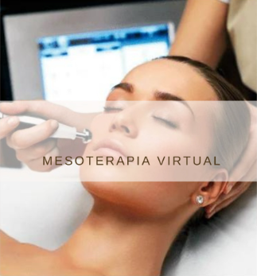

## ✨ Ultherapy HIFU – Lifting Facial y Corporal sin Cirugía ✨
Lo tienes abajo en la sección de Ultherapy HIFU

## ✨ Velo de Colágeno Puro ✨
Tratamiento intensivo diseñado para todo tipo de piel, que proporciona limpieza, nutrición y profunda hidratación, dejando el rostro fresco, sano y revitalizado 💆‍♀️

🔬 ¿En qué consiste?
Se aplica un velo de colágeno puro 100% de origen marino, que ayuda a restaurar la elasticidad de la piel, mejorar la firmeza y aportar un efecto rejuvenecedor inmediato. Este tratamiento favorece la regeneración celular y mantiene la piel protegida frente a los signos de fatiga y envejecimiento.

🌿 Beneficios principales:
✔️ Hidratación profunda y duradera
✔️ Piel más suave, luminosa y saludable
✔️ Mejora la elasticidad y firmeza
✔️ Limpieza y revitalización de la piel
✔️ Ideal para pieles apagadas, deshidratadas o con signos de cansancio

⏱️ Duración: 90 minutos
💰 Precio por sesión: 150 €

✨ Dale a tu piel un cuidado completo y nutritivo con este tratamiento de colágeno marino.
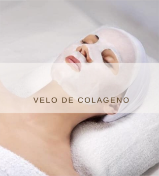

## ✨ Dermapen + Hidratación Facial ✨
Tratamiento combinado que potencia la regeneración y revitalización de la piel, uniendo la tecnología del Dermapen con una hidratación profunda de alto impacto 💆‍♀️

🔬 ¿Cómo funciona?
El Dermapen realiza micro punciones controladas sobre la piel, estimulando los fibroblastos responsables de la producción de colágeno y elastina. Esto ayuda a reafirmar, tonificar y rejuvenecer el rostro de manera natural.

🌿 Incluye:
✔️ Limpieza facial profunda para eliminar impurezas y preparar la piel
✔️ Micro punciones con Dermapen para estimular la regeneración celular
✔️ Hidratación intensiva con ácido hialurónico y vitaminas, aportando luminosidad y elasticidad
✔️ Mejora de textura, firmeza y tono de la piel

🌟 Beneficios:
• Piel más tersa, suave y rejuvenecida
• Reducción de líneas finas y arrugas
• Mejora la absorción de activos hidratantes y nutritivos
• Rostro revitalizado y con apariencia saludable

⏱️ Duración: 75 minutos en total (incluyendo limpieza e hidratación)

💰 Precio por sesión: 150 €
💰 Precio pack (6 sesiones): 800€
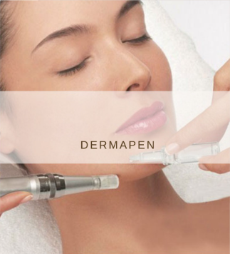

## ✨ Dermapen Cicatrices ✨
Tratamiento avanzado que utiliza microagujas para estimular la regeneración natural de la piel, restaurando colágeno y elastina y mejorando visiblemente la apariencia de cicatrices de acné 💆‍♀️

🔬 ¿Cómo funciona?
El Dermapen realiza microperforaciones controladas en la piel, activando el proceso de reparación natural del cuerpo. Esto no solo mejora las marcas existentes, sino que también fortalece la estructura de la piel, aumentando su firmeza y elasticidad.

🌿 Beneficios principales:
✔️ Reducción de cicatrices de acné y marcas superficiales
✔️ Estimulación de colágeno y elastina para una piel más firme
✔️ Mejora de la textura y suavidad de la piel
✔️ Tono más uniforme y aspecto rejuvenecido
✔️ Procedimiento mínimamente invasivo y seguro para todo tipo de piel

⏱️ Duración del tratamiento: 60 minutos
💰 Precio por sesión: 75 €

💡 Recomendaciones:
Se pueden requerir varias sesiones según la profundidad de las cicatrices. Es importante seguir las indicaciones posteriores al tratamiento, como el uso de productos calmantes y protección solar, para optimizar los resultados y favorecer la recuperación de la piel.

## ✨ Peeling Anti-Manchas ✨
Un tratamiento avanzado y no quirúrgico diseñado para eliminar manchas, mejorar la textura de la piel y rejuvenecer el rostro desde el interior 💆‍♀️

🔬 ¿En qué consiste?
Peeling químico despigmentante con combinación de 4 ácidos, que actúa eliminando las capas superficiales de la piel de forma controlada, según las necesidades de cada caso.

Se combina con radiofrecuencia, que estimula la producción de colágeno y mejora la firmeza de la piel, potenciando los resultados ✨

📅 Incluye:
✔️ 4 sesiones completas
✔️ Eliminación progresiva de manchas e imperfecciones
✔️ Renovación de la piel a nivel profundo
✔️ Estimulación de la matriz dérmica

🌿 Ideal para tratar:
• Manchas y tono desigual
• Arrugas faciales
• Cicatrices de acné
• Piel envejecida o con falta de firmeza

🌟 Beneficios:
• Piel más uniforme y luminosa
• Mejora de la firmeza y elasticidad
• Reducción visible de manchas y arrugas
• Rostro rejuvenecido y revitalizado

⏱️ Duración por sesión: 60 minutos
💰 Precio por sesión: 175 €
💰 Precio pack (5 sesiones): 800€

✨ Un tratamiento completo para transformar tu piel de forma progresiva y duradera
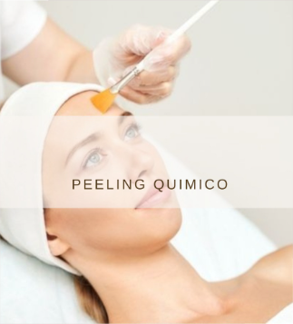

## ✨ Peeling Químico Facial ✨
Tratamiento estético de exfoliación profunda que renueva la piel mediante la aplicación controlada de una solución química (sin fricción), eliminando células dañadas y estimulando la regeneración celular para un rostro más luminoso y uniforme 💆‍♀️

🔬 ¿Qué trata?
• Manchas cutáneas (hiperpigmentación y daño solar)
• Marcas y cicatrices de acné
• Líneas de expresión y arrugas finas
• Poros dilatados y textura irregular
• Piel apagada o con signos de envejecimiento

🌿 ¿Cómo se realiza?
✔️ Limpieza previa del rostro
✔️ Aplicación del peeling según tu tipo de piel
✔️ Productos calmantes y protectores para potenciar resultados

🌟 Beneficios:
• Estimula la producción de colágeno
• Mejora visiblemente la textura y el tono
• Aporta luminosidad inmediata
• Piel más suave, uniforme y rejuvenecida

⏱️ Duración: 45 minutos
💰 Precio por sesión: 150 €

Después del tratamiento puede aparecer un leve enrojecimiento o descamación (normal en el proceso de renovación). Es fundamental usar protector solar y seguir las recomendaciones profesionales ☀️

## ✨ Dermaplaning Facial ✨
El Dermaplaning es un tratamiento estético avanzado diseñado para eliminar células muertas y vello fino del rostro, logrando una piel más luminosa, suave y saludable 💆‍♀️. Se utiliza un bisturí quirúrgico especial para raspar cuidadosamente la superficie de la piel, retirando impurezas, células muertas y el vello conocido como vellus, que puede dar un aspecto opaco al rostro.

🔬 ¿Cómo funciona?

La técnica consiste en pasar suavemente el bisturí sobre la piel limpia y seca, retirando las capas superficiales que ya no cumplen función.

Esto permite que la piel se renueve de manera natural y que los productos cosméticos posteriores penetren mejor, potenciando su eficacia.

Además de mejorar la textura, el dermaplaning promueve un tono más uniforme y un brillo saludable.

🌟 Beneficios principales:
✔️ Elimina células muertas y vello fino del rostro
✔️ Mejora la luminosidad y suavidad de la piel
✔️ Favorece la absorción de tratamientos posteriores
✔️ Uniformiza el tono y la textura de la piel
✔️ Procedimiento seguro, rápido y sin dolor
✔️ Ideal para todo tipo de piel, incluso piel sensible

⏱️ Duración del tratamiento: 45 minutos
💰 Precio: 50€ 
💼 Pack de 10 sesiones: 400 €

💡 Recomendaciones:
Se aconseja realizar sesiones periódicas cada 4 a 6 semanas para mantener la piel renovada y maximizar los resultados. Evitar exposición solar directa inmediatamente después y aplicar protección solar para cuidar la piel recién exfoliada.✨ Dermaplaning Facial ✨
El Dermaplaning es un tratamiento estético avanzado diseñado para eliminar células muertas y vello fino del rostro, logrando una piel más luminosa, suave y saludable 💆‍♀️. Se utiliza un bisturí quirúrgico especial para raspar cuidadosamente la superficie de la piel, retirando impurezas, células muertas y el vello conocido como vellus, que puede dar un aspecto opaco al rostro.

🔬 ¿Cómo funciona?

La técnica consiste en pasar suavemente el bisturí sobre la piel limpia y seca, retirando las capas superficiales que ya no cumplen función.

Esto permite que la piel se renueve de manera natural y que los productos cosméticos posteriores penetren mejor, potenciando su eficacia.

Además de mejorar la textura, el dermaplaning promueve un tono más uniforme y un brillo saludable.

🌟 Beneficios principales:
✔️ Elimina células muertas y vello fino del rostro
✔️ Mejora la luminosidad y suavidad de la piel
✔️ Favorece la absorción de tratamientos posteriores
✔️ Uniformiza el tono y la textura de la piel
✔️ Procedimiento seguro, rápido y sin dolor
✔️ Ideal para todo tipo de piel, incluso piel sensible

⏱️ Duración del tratamiento: 45 minutos
💰 Precio: 50€ 
💼 Pack de 10 sesiones: 400 €

💡 Recomendaciones:
Se aconseja realizar sesiones periódicas cada 4 a 6 semanas para mantener la piel renovada y maximizar los resultados. Evitar exposición solar directa inmediatamente después y aplicar protección solar para cuidar la piel recién exfoliada.
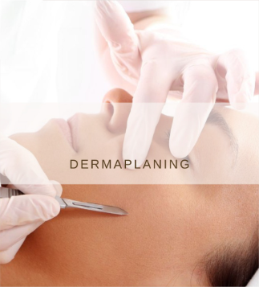

## ✨ Limpieza Facial PLATINUM ✨
Un tratamiento avanzado que combina limpieza profunda con una potente hidratación para devolverle a tu piel su luminosidad, frescura y vitalidad.

✔️ Limpieza facial profunda para eliminar impurezas, exceso de grasa y residuos acumulados
✔️ Exfoliación suave que favorece la renovación celular y mejora la textura de la piel
✔️ Hidratación intensiva con ácido hialurónico, que ayuda a retener la humedad y aporta efecto relleno
✔️ Aplicación de vitamina C, potente antioxidante que ilumina el rostro y combate los signos de fatiga
✔️ Mejora la elasticidad, suavidad y uniformidad del tono de la piel
✔️ Finalización con crema facial para sellar la hidratación y proteger la piel

💆‍♀️ Tratamiento ideal para pieles deshidratadas, apagadas o con falta de luminosidad, que buscan un efecto rejuvenecedor sin procedimientos invasivos.

⏱️ Duración: 60 minutos
💰 Precio: 75€

🌟 Disfruta de una piel más luminosa, hidratada y revitalizada desde la primera sesión, con un aspecto saludable y radiante.
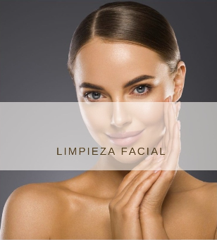

## ✨ Limpieza Facial DETOX ✨
Higiene Detox + Peeling con Nanoagujas

Un tratamiento innovador que combina limpieza profunda y tecnología avanzada para purificar, renovar y revitalizar la piel desde el interior 💆‍♀️

🔬 ¿Qué incluye?
✔️ Higiene facial profunda para eliminar impurezas, toxinas y exceso de grasa
✔️ Peeling con nanoagujas que estimula la regeneración celular sin dañar la piel
✔️ Mejora la absorción de activos, potenciando sus efectos
✔️ Mascarilla detoxificante que purifica, calma y equilibra la piel
✔️ Estimula la renovación cutánea y mejora la textura

🌿 Ideal para:
Pieles apagadas, congestionadas, con impurezas o falta de vitalidad

🌟 Beneficios:
• Piel más luminosa y fresca desde la primera sesión
• Textura más uniforme y suave
• Poros más limpios y menos visibles
• Rostro revitalizado y con aspecto saludable

⏱️ Duración: 90 minutos
💰 Precio por sesión: 150 €

✨ Devuélvele a tu piel su frescura, pureza y vitalidad con este tratamiento detox avanzado

## ✨ Limpieza Facial DIAMOND ✨
Un tratamiento completo para lograr una piel limpia, hidratada y radiante.

✔️ Limpieza facial profunda
✔️ Hidratación con aparatología facial avanzada
✔️ Aplicación de tres exfoliantes para renovar la piel
✔️ Serum nutritivo para potenciar los resultados
✔️ Mascarilla adaptada a tu tipo de piel
✔️ Finalizamos con crema facial para una hidratación duradera

⏱️ Duración: 90 minutos
💰 Precio por sesión: 150 €

💎 Ideal para quienes buscan una piel más luminosa, suave y rejuvenecida.✨ Limpieza Facial DIAMOND ✨
Un tratamiento completo para lograr una piel limpia, hidratada y radiante.

✔️ Limpieza facial profunda
✔️ Hidratación con aparatología facial avanzada
✔️ Aplicación de tres exfoliantes para renovar la piel
✔️ Serum nutritivo para potenciar los resultados
✔️ Mascarilla adaptada a tu tipo de piel
✔️ Finalizamos con crema facial para una hidratación duradera

⏱️ Duración: 90 minutos
💰 Precio por sesión: 150 €

💎 Ideal para quienes buscan una piel más luminosa, suave y rejuvenecida.

## ✨ Limpieza Facial ELITE ✨
Disfruta de un tratamiento exclusivo diseñado para renovar, hidratar y revitalizar tu piel.

✔️ Limpieza facial profunda
✔️ Hidratación intensiva utilizando aparatología facial avanzada
✔️ Aplicación de exfoliantes para una piel más suave y luminosa
✔️ Máscara de yesoterapia para un efecto reafirmante y revitalizante
✔️ Finalizamos con crema facial nutritiva y protector solar

⏱️ Duración: 120 minutos
💰 Precio por sesión: 200 €

💆‍♀️ Dale a tu piel el cuidado que se merece y luce un rostro radiante desde la primera sesión.✨ Limpieza Facial ELITE ✨
Disfruta de un tratamiento exclusivo diseñado para renovar, hidratar y revitalizar tu piel.

✔️ Limpieza facial profunda
✔️ Hidratación intensiva utilizando aparatología facial avanzada
✔️ Aplicación de exfoliantes para una piel más suave y luminosa
✔️ Máscara de yesoterapia para un efecto reafirmante y revitalizante
✔️ Finalizamos con crema facial nutritiva y protector solar

⏱️ Duración: 120 minutos
💰 Precio por sesión: 200 €

💆‍♀️ Dale a tu piel el cuidado que se merece y luce un rostro radiante desde la primera sesión.

## ✨ Limpieza Facial GOLD ✨
Un tratamiento esencial, delicado y efectivo, ideal para mantener la piel limpia, equilibrada y saludable sin procedimientos agresivos.

✔️ Higiene facial profunda adaptada a todo tipo de piel
✔️ Extracción cuidadosa de comedones (puntos negros) e impurezas acumuladas
✔️ Eliminación de células muertas para favorecer la renovación cutánea
✔️ Mejora visible de la textura y apariencia de la piel
✔️ Ayuda a prevenir la obstrucción de poros y futuras imperfecciones
✔️ Aporta frescura, suavidad y un aspecto más uniforme

💆‍♀️ Procedimiento no invasivo, pensado para quienes buscan un cuidado básico pero efectivo, manteniendo la piel limpia y saludable en el día a día.

⏱️ Duración: 45 minutos
💰 Precio: 50€

🌟 Ideal como mantenimiento regular o como primer paso antes de tratamientos más avanzados. Tu piel lucirá más limpia, equilibrada y con un aspecto natural desde la primera sesión.

## ✨ Acné Tratamiento Anti-Acné ✨
Un cuidado facial especializado diseñado para combatir eficazmente el acné, calmar la piel y prevenir futuras imperfecciones, ayudando a recuperar un rostro más limpio y equilibrado 💆‍♀️

🔬 ¿Qué incluye?
✔️ Limpieza facial profunda para eliminar impurezas, grasa y residuos acumulados en los poros
✔️ Aplicación de activos específicos anti-acné que regulan el sebo y combaten bacterias
✔️ Sesión de alta frecuencia que reduce la inflamación, acelera la cicatrización y previene nuevos brotes
✔️ Estimula la renovación celular
✔️ Mejora la textura de la piel
✔️ Ayuda a disminuir puntos negros, espinillas y marcas recientes

🌿 Ideal para:
Pieles con acné activo, tendencia grasa o inflamatoria

🌟 Resultados:
• Piel más limpia y purificada
• Menos rojeces e inflamación
• Tono más uniforme
• Apariencia más fresca y saludable

⏱️ Duración: 45 minutos
💰 Precio: 75€

✨ Resultados visibles desde las primeras sesiones
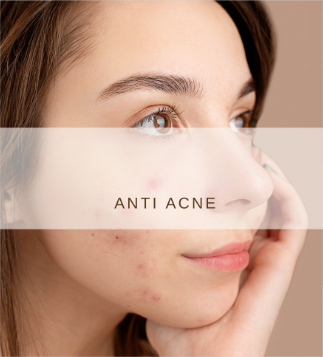

# Ultherapy - HIFU
## ✨ Ultherapy HIFU – Lifting Facial y Corporal sin Cirugía ✨
Ultrasonido Focalizado – Reafirma, Moldea y Rejuvenece 
Descubre el tratamiento no invasivo que redefine tu piel desde el interior 💆‍♀️
Gracias a la tecnología avanzada de ultrasonido, estimulamos la producción natural de colágeno y elastina para lograr un efecto lifting sin cirugía.

🔬 ¿Cómo funciona?
El ultrasonido focalizado actúa en las capas profundas de la piel, activando su regeneración natural y consiguiendo:

✔️ Reafirmación visible
✔️ Reducción de la flacidez
✔️ Eliminación de grasa localizada
✔️ Remodelación del contorno facial y corporal
✔️ Piel más firme, elástica y joven

🌿 Zonas y precios:

💎 Facial completo – 350 € (120 min)
💎 Ojeras – 160 € (20 min)
💎 Cuello – 250 € (60 min)
💎 Escote – 250 € (60 min)
💎 Brazos – 350 € (60 min)
💎 Manos – 200 € (30 min)
💎 Abdomen – 350 € (60 min por zona)
💎 Medias piernas – 350 € (45 min por zona)
💎 Tratamiento vaginal – 495 € (45 min)

🌟 Beneficios:
✨ Efecto lifting natural y progresivo
✨ Piel más firme y tonificada
✨ Reducción de grasa y flacidez
✨ Contornos más definidos
✨ Resultados duraderos sin cirugía

⏱️ Duración: según la zona tratada
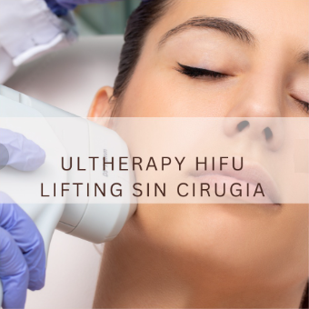

# Radiofrecuencia Indiba
## ✨ Radiofrecuencia Tratamiento Anti-Edad ✨
Radiofrecuencia INDIBA – Reafirma, Rejuvenece y Revitaliza tu Piel 
Descubre uno de los tratamientos más avanzados para mejorar la piel sin cirugía 💆‍♀️
La tecnología INDIBA actúa en profundidad estimulando colágeno y elastina en las tres capas de la piel, logrando un efecto visible desde las primeras sesiones.

🔬 ¿Qué consigue?
✔️ Reafirma y tonifica rostro y cuerpo
✔️ Reduce flacidez, arrugas y líneas de expresión
✔️ Mejora la elasticidad y firmeza
✔️ Efecto lifting natural
✔️ Piel más luminosa, hidratada y saludable

🌿 Duración y precios:
💎 Facial (45 min) – 65 €
💎 Corporal (45 min) – 65 € por zona

🎁 Bonos especiales:
✨ Pack 5 sesiones (30 min) – 225 €
✨ Pack 10 sesiones (30 min) – 400 €

🌟 Ideal para:
Personas con flacidez, pérdida de firmeza o signos de envejecimiento en rostro y cuerpo

💫 Resultados progresivos y duraderos, con una sensación inmediata de piel más firme y revitalizada
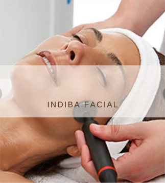

# Depilación
## ✨ Depilación  ✨
Depilación IPL – Luz Pulsada Intensa
Di adiós al vello de forma segura, cómoda y duradera 💆‍♀️
La tecnología IPL actúa directamente desde la raíz del vello, debilitándolo progresivamente hasta lograr una piel suave y libre de irritaciones.

🌿 Zonas y precios por sesión:

🔹 Zonas pequeñas – 12 €
Labio superior, mentón, patillas, areola, dedos de los pies, cuello, manos, entrecejo, sienes, orejas, mejillas

🔹 Zonas medianas – 25 €
Facial completo, axilas, ingles, línea interglútea/perianal, antebrazos, pubis, hombros

🔹 Zonas grandes – 35 €
Media pierna, zona íntima completa, brazos, glúteos, abdomen, tórax, espalda

🔹 Zonas extra grandes – 55 €
Piernas completas, espalda completa

💎 Paquetes corporales:
• Cuerpo completo – 125 €
• Medio cuerpo (superior o inferior) – 80 €

🔥 OFERTA ESPECIAL
Axilas + media pierna + bikini completo
👉 Solo 85 € por sesión
💼 Pack 10 sesiones: 800 €

🌟 Beneficios:
✔️ Reducción progresiva y duradera del vello
✔️ Piel más suave, sin irritación
✔️ Tratamiento rápido y prácticamente indoloro
✔️ Apto para diferentes zonas del cuerpo
✔️ Resultados visibles desde las primeras sesiones

💡 Recomendación:
Evita el sol antes y después del tratamiento y respeta los tiempos entre sesiones para mejores resultados.
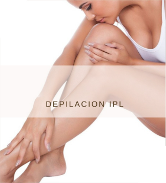

# Maderoterapia 
## ✨ Maderoterapia ✨
Tratamiento de masaje estético que utiliza herramientas de madera especialmente diseñadas para **estimular la circulación, tonificar y reafirmar la piel** 💆‍♀️. Es especialmente efectivo para zonas con grasa localizada, flacidez o celulitis.

🔬 ¿Cómo funciona?
Mediante movimientos precisos con rodillos y otros utensilios de madera, se activa la circulación sanguínea y linfática, se mejora la oxigenación de los tejidos y se estimula la producción de colágeno y elastina, favoreciendo la firmeza y elasticidad de la piel.

🌟 Beneficios principales:
✔️ Reduce grasa localizada y volumen abdominal
✔️ Mejora la circulación sanguínea y linfática
✔️ Tonifica y reafirma la piel
✔️ Estimula colágeno y elastina
✔️ Contribuye a la reducción de celulitis
✔️ Relajante y revitalizante

⏱️ Duración del tratamiento: 30 minutos
💰 Precio por sesión: 40 €
💰 Pack 10 sesiones: 360 €

💡 Recomendaciones:
Se recomienda complementar con hidratación, alimentación equilibrada y ejercicio para potenciar resultados.
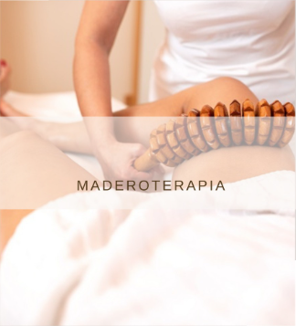

# Presoterapia
## ✨ Presoterapia ✨
Tratamiento no invasivo que utiliza presiones de aire controladas para estimular el drenaje linfático, mejorar la circulación y favorecer la regeneración de los tejidos 💆‍♀️. Ideal para mejorar la apariencia de la piel, reducir retención de líquidos y activar la oxigenación celular.

🔬 ¿Cómo funciona?

Se aplican presiones de aire de manera secuencial sobre piernas, abdomen, brazos u otras áreas del cuerpo.

Estimula el drenaje linfático y la circulación sanguínea, ayudando a eliminar toxinas y líquidos acumulados.

Favorece la oxigenación de los tejidos y mejora la elasticidad de la piel, facilitando la regeneración tisular.

Produce un efecto relajante y revitalizante, dejando la piel más firme y tonificada.

🌟 Beneficios principales:
✔️ Favorece la eliminación de líquidos y toxinas
✔️ Mejora la elasticidad y firmeza de la piel
✔️ Reduce sensación de pesadez en piernas y áreas congestionadas
✔️ Estimula la circulación y oxigenación de los tejidos
✔️ Procedimiento cómodo, seguro y sin dolor

⏱️ Duración: 30 minutos
💰 Precio por sesión: 25 €
💼 Pack de 5 sesiones: 100 €

🌿 Ideal para:
Personas que buscan mejorar circulación, drenaje linfático, tonificar la piel y reducir retención de líquidos de manera eficaz y relajante.
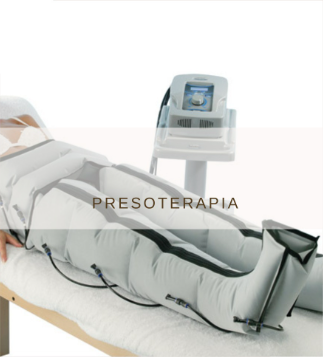

# Dranaje Linfático
## ✨ Drenaje Linfático Postoperatorios ✨
Tratamiento especializado indicado para el periodo postoperatorio, diseñado para acelerar la recuperación, reducir la inflamación y mejorar los resultados de cirugías estéticas o médicas 💆‍♀️

🔬 ¿Cómo funciona?
Se realizan maniobras suaves, lentas y precisas que estimulan el sistema linfático, ayudando a eliminar líquidos retenidos, toxinas y restos de anestesia acumulados tras la cirugía.

Este tratamiento favorece la desinflamación de los tejidos y contribuye a una recuperación más rápida, cómoda y segura. Además, es ideal para eliminar líquidos, mejorar visiblemente la piel y activar el sistema linfático, siendo muy eficaz en casos de retención de líquidos, edemas y tratamientos estéticos.

🌟 Beneficios principales:
✔️ Reduce la inflamación y edemas
✔️ Disminuye hematomas y molestias
✔️ Previene la fibrosis y endurecimientos
✔️ Mejora la cicatrización
✔️ Favorece la eliminación de líquidos y toxinas
✔️ Mejora la visibilidad y aspecto de la piel
✔️ Estimula el sistema linfático
✔️ Acelera la recuperación postoperatoria
✔️ Mejora los resultados estéticos finales

🌿 Ideal para:
Postoperatorios de liposucción, abdominoplastia, aumento de pecho, lifting u otros procedimientos estéticos o médicos, así como para personas con retención de líquidos o edemas

⏱️ Duración del tratamiento: 45 minutos O 60 minutos
💰 Precio por sesión: 65 € – 75 €
       Pack de 10 sesiones 600 € -- 700€
💡 Recomendaciones:
Se recomienda iniciar las sesiones según indicación médica y realizar un seguimiento continuo para obtener mejores resultados. Beber abundante agua y seguir las pautas profesionales es clave para una recuperación óptima.
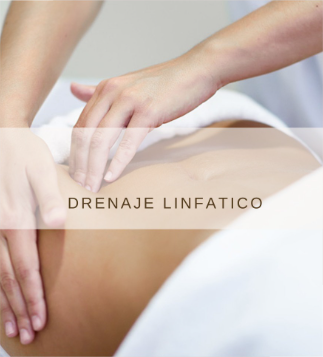

# Pestañas
## ✨ Pestañas Pelo a Pelo ✨
Tratamiento de extensión de pestañas que consiste en colocar una pestaña artificial sobre cada pestaña natural, logrando un efecto más largo, definido y natural 💆‍♀️. Ideal para realzar la mirada sin necesidad de maquillaje diario.

🔬 ¿En qué consiste?
Se realiza una aplicación individualizada sobre cada vello natural, respetando la forma de tu ojo y el estilo deseado. El resultado es una mirada más intensa, con mayor volumen y longitud, manteniendo un acabado elegante y natural.

🌟 Beneficios principales:
✔️ Alarga y define las pestañas de forma natural
✔️ Aporta volumen y densidad
✔️ Efecto semipermanente
✔️ Evita el uso diario de máscara de pestañas
✔️ Resultado personalizado según tu estilo

✨ Puesta nueva:
• Clásicas – 70 €
• Hawaiano – 70 €
• Mega Volumen – 80 €
• Foxy Eyes – 80 €
• Wispy – 80 €

✨ Retoques:
Los retoques se realizan cada 15–20 días y tienen un valor del 50% del precio de la puesta nueva:
• Clásicas / Hawaiano / Volumen 3D – 35 €
• Mega Volumen / Foxy Eyes / Wispy – 40 €

⚠️ Importante:
Si el retoque se realiza fuera del tiempo recomendado, el precio puede variar según el estado de las pestañas.

⏱️ Duración del tratamiento: 120 minutos
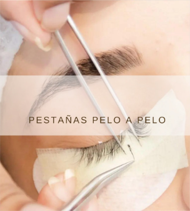

# Micropigmentación
## ✨ Micropigmentación (Maquillaje Semipermanente) ✨
Tratamiento estético de maquillaje semipermanente que realza y define rasgos faciales o zonas específicas, con resultados naturales y duraderos 💆‍♀️. Su duración puede superar el año, dependiendo del tipo de piel y cuidados posteriores.

🔬 ¿En qué consiste?
Se realiza un diseño previo personalizado adaptado a cada rostro o zona a tratar, garantizando un resultado armonioso. Posteriormente, se implantan pigmentos en la piel mediante una técnica segura y prácticamente indolora, logrando un acabado inmediato y natural.

En cejas, se pueden realizar técnicas de efecto pelo a pelo o sombreado, adaptadas al estilo y resultado deseado (natural o más definido).

🌟 Beneficios principales:
✔️ Resultados visibles desde la primera sesión
✔️ Ahorro de tiempo en maquillaje diario
✔️ Mejora la simetría y definición
✔️ Efecto natural y duradero
✔️ Procedimiento seguro y cómodo
✔️ Revisión incluida a los 30 días

🌿 Zonas y precios:
• Ojos – 300 €
• Labios – 300 €
• Cejas – 300 €

💰 Precios desde: 300 €

⏱️ Duración del tratamiento: 120 minutos

💡 Recomendaciones:
Es importante seguir los cuidados posteriores indicados para garantizar una correcta cicatrización y prolongar la duración del pigmento.
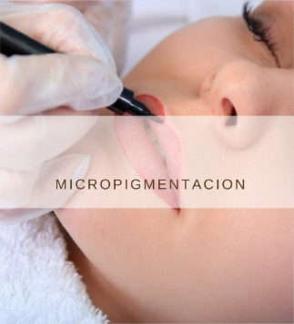

# Tratamientos médicos
## ✨ Hilos Tensores ✨
Tratamiento de medicina estética que utiliza hilos finos para rejuvenecer y tensar el rostro de manera natural 💆‍♀️. Permite mejorar la flacidez, suavizar arrugas y redefinir contornos faciales sin cirugía.

🔬 ¿En qué consiste?
Los hilos se insertan bajo la piel mediante técnicas precisas, proporcionando un efecto tensor inmediato y estimulando la producción natural de colágeno. Dependiendo del tipo de hilo y la zona tratada, se puede:
• Elevar cejas
• Mejorar el óvalo facial
• Redefinir contorno de mandíbula
• Suavizar arrugas y líneas de expresión

🌟 Beneficios principales:
✔️ Reafirma y tensa la piel
✔️ Efecto lifting sin cirugía
✔️ Estimula colágeno natural
✔️ Mejora la definición de contornos faciales
✔️ Resultados visibles desde la primera sesión

💰 Paquetes y precios:

• 4 hilos espiculados – 395 €
• 6 hilos espiculados – 595 €

• 4 hilos espiculados + 12 hilos PDO – 495 €
• 6 hilos espiculados + 16 hilos PDO – 725 €

⏱️ Duración del tratamiento: 60 minutos

💡 Recomendaciones:
Evitar masajes intensos y esfuerzos físicos durante los primeros días. Seguir las indicaciones del especialista para prolongar los resultados y asegurar una recuperación óptima.
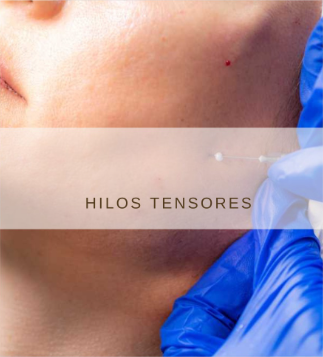

## ✨ Relleno con Ácido Hialurónico ✨
Tratamiento estético mínimamente invasivo que permite remodelar y rejuvenecer los contornos del rostro y labios, devolviendo volumen a zonas afectadas por el envejecimiento 💆‍♀️.

🔬 ¿En qué consiste?
Se aplican inyecciones de ácido hialurónico en zonas específicas para rellenar surcos, redefinir contornos o aumentar el volumen de labios. El procedimiento incluye una revisión entre 15 y 30 días para asegurar el resultado óptimo.

🌟 Beneficios principales:
✔️ Remodela y define el rostro
✔️ Devuelve volumen a zonas envejecidas
✔️ Suaviza surcos y líneas de expresión
✔️ Mejora la armonía facial
✔️ Procedimiento seguro y rápido
✔️ Resultados visibles e inmediatos

🌿 Zonas y precios por vial:
• Surco nasogeniano – 300 €
• Rinomodelación – 450 €
• Labios – 350 €

⏱️ Duración del tratamiento: 30 minutos
💰 Precio por vial: según zona

💡 Recomendaciones:
Evitar masajes intensos, exposición prolongada al sol o saunas durante los primeros días. Seguir la revisión indicada para mantener el resultado perfecto.
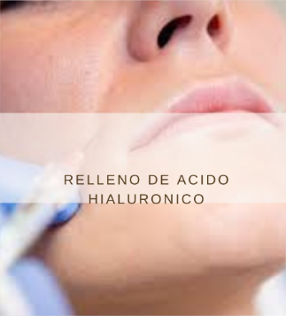

## ✨ Botox por Zona ✨
Tratamiento estético que consiste en la inyección de toxina botulínica para bloquear temporalmente determinadas señales químicas de los nervios, reduciendo la contracción de los músculos faciales responsables de las arrugas 💆‍♀️.

🔬 ¿En qué consiste?
Se aplica de forma precisa en los músculos que generan líneas de expresión, como la frente, entrecejo y alrededor de los ojos. Esto permite suavizar arrugas y prevenir la formación de nuevas líneas, manteniendo un aspecto natural y relajado.

🌟 Beneficios principales:
✔️ Reduce arrugas dinámicas
✔️ Previene la aparición de nuevas líneas de expresión
✔️ Efecto natural y armonioso
✔️ Procedimiento rápido y mínimamente invasivo
✔️ Resultados visibles en pocos días

🌿 Ideal para:
Personas que buscan suavizar arrugas de la frente, entrecejo o patas de gallo, o mejorar la apariencia general del rostro.

⏱️ Duración del tratamiento: 30 minutos
💰 Precio por zona: 300 €

💡 Recomendaciones:
Evitar masajes, saunas o ejercicio intenso en las primeras 24 horas tras la aplicación para asegurar un efecto óptimo.
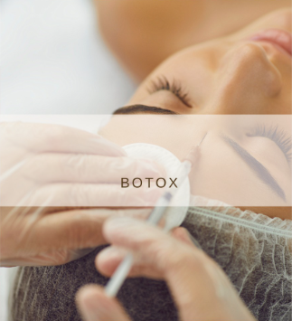

## ✨ Plasma Rico en Plaquetas (PRP) ✨
Tratamiento avanzado de bioestimulación que utiliza los propios factores de crecimiento del paciente para rejuvenecer la piel de forma natural 💆‍♀️. Es un procedimiento seguro, eficaz y mínimamente invasivo que ayuda a retrasar el envejecimiento cutáneo y mejorar la calidad de la piel.

🔬 ¿En qué consiste?
Se extrae una pequeña muestra de sangre del paciente, que posteriormente se centrifuga para separar el plasma rico en plaquetas. Este concentrado se aplica en la piel, estimulando la regeneración celular y la producción de colágeno y elastina.

🌿 ¿Qué consigue?
• Regeneración y revitalización de la piel
• Mejora de la textura y luminosidad
• Reducción de arrugas finas y líneas de expresión
• Mayor firmeza y elasticidad
• Piel más hidratada y rejuvenecida

🌟 Beneficios principales:
✔️ Tratamiento natural con tu propio plasma
✔️ Estimula el colágeno y la elastina
✔️ Mejora la calidad y apariencia de la piel
✔️ Resultados progresivos y duraderos
✔️ Procedimiento seguro y biocompatible

🌿 Ideal para:
Pieles con signos de envejecimiento, falta de luminosidad, flacidez o deshidratación

⏱️ Duración del tratamiento: 60 minutos
💰 Precio: 275 €

💡 Recomendaciones:
Se pueden requerir varias sesiones según las necesidades de la piel. Es importante seguir los cuidados posteriores indicados para potenciar los resultados.
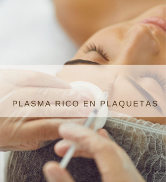

## ✨ Láser de Plasma Pen ✨
Tratamiento estético innovador y no invasivo que permite eliminar pequeñas imperfecciones de la piel sin necesidad de cirugía 💆‍♀️. Actúa de forma precisa sobre la zona tratada, creando una micro “quemadura” controlada que elimina la lesión sin dañar los tejidos circundantes.

🔬 ¿En qué consiste?
El láser de plasma trabaja generando un pequeño punto de energía en la superficie de la piel, estimulando su regeneración natural. Esto permite eliminar o reducir imperfecciones mientras se activa la producción de colágeno, mejorando la calidad y firmeza de la piel.

🌿 Ideal para tratar:
• Pecas
• Manchas
• Verrugas
• Pequeñas lesiones cutáneas
• Imperfecciones localizadas

🌟 Beneficios principales:
✔️ Elimina o minimiza imperfecciones de forma precisa
✔️ No daña los tejidos cercanos
✔️ Estimula la regeneración de la piel
✔️ Mejora la textura y apariencia general
✔️ Procedimiento no quirúrgico
✔️ Resultados visibles desde las primeras sesiones

⏱️ Duración del tratamiento: 30 minutos
💰 Precio desde: 95 €

💡 Recomendaciones:
Tras el tratamiento puede aparecer una leve costra temporal, parte del proceso natural de cicatrización. Es importante no manipular la zona y utilizar protección solar para una correcta recuperación.
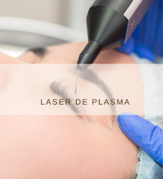

# Masajes
## ✨ Masaje Corporal ✨
Tratamiento completo que se aplica sobre el sistema músculo-esquelético del cuerpo para liberar tensiones, relajar músculos y producir un efecto sedante y revitalizante 💆‍♀️. Ideal para quienes buscan aliviar molestias, contracturas o simplemente desconectar y relajarse.

🔬 ¿Cómo funciona?
Se utilizan técnicas activas y precisas que trabajan sobre músculos, tendones y articulaciones, estimulando el sistema nervioso y promoviendo la relajación profunda, al mismo tiempo que mejora la circulación y tonifica los músculos.

🌟 Beneficios principales:
✔️ Libera tensiones musculares acumuladas
✔️ Relaja y tonifica todo el cuerpo
✔️ Estimula el sistema nervioso para un efecto sedante
✔️ Mejora la circulación sanguínea
✔️ Reduce estrés y fatiga corporal

⏱️ Duración y precios:
• 60 minutos – 85 €
• 50 minutos – 85 €
• 45 minutos – 75 €
• 30 minutos – 55 €
• 15 minutos – 35 €

💡 Recomendaciones:
Complementar con hidratación y estiramientos suaves tras el masaje para prolongar los beneficios y mantener el bienestar general.
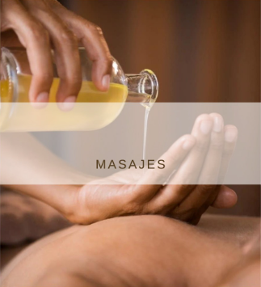

## ✨ Masaje Relajante ✨
Tratamiento diseñado para relajar cuerpo y mente mediante técnicas suaves combinadas con aceites vegetales y esenciales 100% naturales 💆‍♀️. Ideal para aliviar estrés, tensión muscular y contracturas, mientras promueve la circulación y la eliminación de toxinas.

🔬 ¿Cómo funciona?
Se aplican movimientos amplios y precisos sobre piernas, brazos, cuello y espalda, ayudando a liberar la tensión acumulada y proporcionando una sensación profunda de bienestar físico y mental.

🌟 Beneficios principales:
✔️ Alivia estrés, ansiedad y nerviosismo
✔️ Suaviza contracturas y tensión muscular
✔️ Estimula la circulación sanguínea
✔️ Facilita la eliminación de toxinas
✔️ Proporciona una experiencia relajante y reconfortante

⏱️ Duración y precios:
• 60 minutos – 75 €
• 45 minutos – 65 €
• 30 minutos – 45 €
• 15 minutos – 25 €

💡 Recomendaciones:
Ideal combinar con hidratación y respiración profunda para potenciar sus efectos. Perfecto para sesiones periódicas de relajación o después de jornadas intensas.

## ✨ Masaje Cráneo-Facial-Cervical ✨
Tratamiento relajante que combina técnicas de masaje en cara, cabeza, cuello, trapecios y cuero cabelludo con el uso de aceites esenciales 💆‍♀️. Ideal para liberar estrés, aliviar la tensión muscular y mental, y mejorar la movilidad y el tono de la musculatura de la zona.

🔬 ¿Cómo funciona?
Se aplican movimientos suaves y precisos sobre el rostro, cráneo, cervicales y hombros, liberando contracturas y estimulando la circulación. La combinación con aceites esenciales potencia la relajación y el bienestar general.

🌟 Beneficios principales:
✔️ Libera estrés y ansiedad
✔️ Relaja la musculatura facial y cervical
✔️ Mejora la movilidad y el tono muscular
✔️ Alivia tensión en cuello, hombros y cabeza
✔️ Estimula circulación y bienestar general

⏱️ Duración y precios:
• 30 minutos – 50 €
• 45 minutos – 75 €

💡 Recomendaciones:
Ideal para realizar de forma regular como parte de rutinas de relajación o bienestar. Evitar actividad física intensa inmediatamente después del masaje para prolongar sus efectos.

## ✨ Masaje Podal ✨
Tratamiento relajante diseñado para revitalizar y aliviar los pies, mejorando la circulación y proporcionando bienestar en todo el cuerpo 💆‍♀️.

🔬 ¿Cómo funciona?
Se aplican técnicas de presión y movimientos precisos sobre los pies, estimulando la circulación sanguínea y linfática. Además, sus efectos se extienden a piernas, brazos y cuello, promoviendo una sensación general de relajación y alivio de la tensión.

🌟 Beneficios principales:
✔️ Revitaliza pies cansados
✔️ Mejora la circulación sanguínea y linfática
✔️ Alivia tensión en piernas, brazos y cuello
✔️ Relaja y disminuye el estrés
✔️ Estimula la energía y bienestar general

⏱️ Duración del tratamiento: 
💰 Precios : 
• 45 minutos – 65 €
• 30 minutos – 45 €

💡 Recomendaciones:
Ideal realizar de forma regular para mantener la circulación activa y reducir la fatiga en extremidades. Complementar con hidratación y estiramientos suaves.

## ✨ Masaje Piernas Cansadas ✨
Tratamiento especializado diseñado para aliviar piernas cansadas, pesadas o hinchadas mediante técnicas de masaje que estimulan la circulación y el drenaje linfático 💆‍♀️.

🔬 ¿Cómo funciona?
Se realizan movimientos rítmicos y precisos sobre las piernas, promoviendo la eliminación de líquidos retenidos, mejorando el retorno venoso y linfático, y reduciendo la sensación de pesadez o hinchazón.

🌟 Beneficios principales:
✔️ Alivia la sensación de piernas cansadas
✔️ Reduce hinchazón y edemas
✔️ Mejora la circulación sanguínea y linfática
✔️ Favorece la eliminación de toxinas
✔️ Relaja y tonifica los músculos de las piernas

⏱️ Duración del tratamiento: 
💰 Precios : 
• 45 minutos – 65 €
• 30 minutos – 45 €

💡 Recomendaciones:
Ideal combinar con hidratación y hábitos saludables de circulación, como caminar o elevar las piernas después del masaje, para mantener los resultados.

## ✨ Masaje Hidratante con Aloe Vera ✨
Tratamiento corporal que combina envoltura y masaje, diseñado para hidratar, calmar y regenerar la piel 💆‍♀️. Ideal para pieles sensibilizadas, secas o tras la exposición solar.

🔬 ¿Cómo funciona?
Se aplica una envoltura con Aloe Vera puro sobre el cuerpo, aprovechando sus propiedades calmantes y regeneradoras. Posteriormente, se realiza un masaje que facilita la absorción, mejora la circulación y ayuda a restaurar el equilibrio natural de la piel.

🌟 Beneficios principales:
✔️ Hidrata profundamente la piel
✔️ Calma enrojecimientos y sensibilidad
✔️ Favorece la regeneración cutánea
✔️ Relaja y suaviza los músculos
✔️ Recupera el estado natural de la piel tras la exposición solar

⏱️ Duración del tratamiento: 45 minutos
💰 Precio por sesión: 75 €

💡 Recomendaciones:
Ideal para pieles secas o irritadas. Complementar con protección solar y cuidados hidratantes diarios para prolongar los resultados.

## ✨ Masaje Facial con Colágeno ✨
Tratamiento estético diseñado para pieles maduras o deshidratadas, que combina técnicas de masaje profesional con un sérum de colágeno marino, proporcionando hidratación profunda y efecto anti-envejecimiento 💆‍♀️.

🔬 ¿Cómo funciona?
El masaje estimula la circulación y el drenaje facial, mientras el colágeno marino penetra en la piel, ayudando a mantener su firmeza, suavidad y tono natural. Favorece la regeneración de la piel y alisa arrugas y líneas de expresión.

🌟 Beneficios principales:
✔️ Hidratación profunda y duradera
✔️ Reafirma y mejora la elasticidad de la piel
✔️ Reduce arrugas y líneas de expresión
✔️ Suaviza y repara el relieve cutáneo
✔️ Promueve una piel más luminosa y joven

⏱️ Duración del tratamiento: 35 minutos
💰 Precio por sesión: 60 €

💡 Recomendaciones:
Se aconseja complementar con una rutina de cuidado facial y protección solar para prolongar los efectos del tratamiento.

## ✨ Masaje Facial con Vitamina C ✨
Tratamiento estético diseñado para revitalizar, regenerar y reafirmar la piel del rostro 💆‍♀️. Ideal para pieles apagadas, cansadas o estresadas, este masaje combina técnicas profesionales con un concentrado de Vitamina C de alta potencia.

🔬 ¿Cómo funciona?
El masaje estimula la circulación sanguínea y linfática del rostro mientras el concentrado de Vitamina C penetra en la piel, aportando antioxidantes que combaten los radicales libres y favorecen la regeneración celular.

🌟 Beneficios principales:
✔️ Devuelve luminosidad y tono a la piel
✔️ Reafirma y mejora la elasticidad
✔️ Acción antioxidante y regeneradora
✔️ Suaviza líneas finas y fatiga cutánea
✔️ Mejora la textura y vitalidad del rostro

⏱️ Duración del tratamiento: 35 minutos
💰 Precio por sesión: 50 €

💡 Recomendaciones:
Ideal realizarlo como complemento a una rutina de cuidado facial. Aplicar protección solar después del tratamiento para maximizar resultados y proteger la piel.

# Di Adiós al Dolor Muscular
## ✨ Di Adiós al Dolor Muscular – Tratamiento Corporal ✨
Si sufres molestias en hombros, espalda, zona lumbar, rodillas o piernas cansadas, este tratamiento te ayuda a recuperar bienestar y comodidad de manera progresiva y efectiva.

Se trata de un procedimiento no invasivo, diseñado para relajar la musculatura, aliviar la tensión acumulada y favorecer la recuperación corporal.

🔬 Beneficios principales:
✔️ Reduce la sensación de dolor muscular desde las primeras sesiones
✔️ Favorece la relajación y el bienestar general
✔️ Mejora la circulación y la recuperación de las zonas tratadas
✔️ Alivia piernas cansadas o con sensación de pesadez
✔️ Procedimiento cómodo, no invasivo y seguro
✔️ Resultados visibles con varias sesiones

⏱️ Duración y tarifas:
• Sesión corporal (45 min por zona): 65 €
• Pack de 5 sesiones (30 min cada una): 225 €
• Pack de 10 sesiones (30 min cada una): 400 €

🌟 Ideal para:
Personas con molestias musculares, tensión acumulada o sensación de sobrecarga en distintas zonas del cuerpo.
